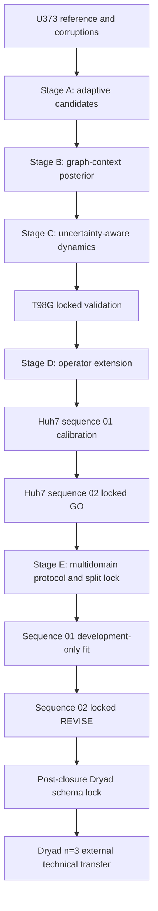

# Glioblastoma Tracking Uncertainty Audit

[](https://github.com/mohamad679/glioblastoma-cell-tracking-uncertainty/actions/workflows/tests.yml)
[](https://github.com/mohamad679/glioblastoma-cell-tracking-uncertainty/actions/workflows/reproduce-benchmark.yml)
[](https://github.com/mohamad679/glioblastoma-cell-tracking-uncertainty/actions/workflows/release.yml)

A reproducible technical audit of how tracking errors and association uncertainty propagate into migration and latent-state estimates for cell-tracking pipelines.

The quantitative benchmark uses expert annotations from the Cell Tracking Challenge PhC-C2DH-U373 dataset. GlioTrace brain-slice data are retained as an exploratory application only. A post-closure external technical-transfer arm additionally evaluates the frozen method on three independent rat glioma brain-slice experiments from Dryad. **This repository does not make a validated human-GBM biological or clinical claim.**

## Current status

| Field | Status |
| --- | --- |
| Version | `1.0.0` |
| Python | 3.11-3.13 |
| License | MIT |
| Tests | CI enforced on all supported Python versions |
| Coverage | 65% enforced CI gate |
| Technical benchmark | Complete |
| Operator learning | Stage D v3 GO — calibrated blend passed locked Huh7 sequence `02` |
| Research Stage D | Formally closed on 2026-09-21 |
| Research Stage E-Final | Complete — valid one-time locked result is `REVISE` |
| External glioma technical transfer | Complete — Dryad biological `n=3`; uncertainty ranking/calibration/selective-risk transferred, while frozen p≥0.5 tracking and motion did not beat hard NN |
| Final project release | Closed as a technical/research-engineering portfolio artifact; post-release evidence extension completed 2026-09-23 |
| Human GBM / clinical validation claim | Not supported |

The operator-learning decision is evidence-derived. The zero-shot Huh7 candidate remained HOLD because of mean-speed bias. A bounded blend calibrated on Huh7 sequence `01` subsequently passed every pre-registered gate on locked sequence `02`. This supports within-Huh7 sequence generalization after calibration, not zero-shot or biological generalization.

The final technical benchmark decision remains intentionally mixed: the staged system is complete and reproducible, Stage D produced a qualified calibrated within-domain `GO`, and Stage E-Final produced a valid locked `REVISE` on multi-domain real CTC data. Stage E is immutable.

A post-closure Dryad arm was then completed under a separate frozen protocol. Across three independent rat PDGFB-glioma brain-slice experiments, frozen calibrated uncertainty strongly improved association-error ranking over distance confidence and reduced selective risk. The frozen `p >= 0.5` uncertainty-compatible hard reconstruction, however, had lower link F1 than hard nearest-neighbour tracking in all three experiments and did not improve the main downstream motion errors. This is external **technical transfer** evidence, not human GBM-wide or clinical validation.

## What this project demonstrates

- deterministic benchmark construction from expert tracking masks and lineages;
- 17 seeded known-truth corruption scenarios;
- baseline and uncertainty-aware association evaluation;
- calibrated link probabilities with development/test separation;
- hard and soft downstream dynamics sensitivity analysis;
- artifact schema/provenance validation across pipeline stages;
- reproducible, pinned environments and real-data GitHub Actions runs;
- regression testing for scientific-correctness bugs;
- archive safety limits for external ZIP inputs;
- performance refactoring with output-equivalence tests;
- pre-outcome schema locking for external biological-context transfer;
- replicate-aware reporting with experiment-level biological `n`;
- explicit separation between technical evidence and biological interpretation.

## Architecture



See [`docs/architecture.md`](docs/architecture.md) for the full module-level architecture, invariants, safety layer, and reproducibility boundaries.

## Reproducible installation

```bash
python3 -m venv .venv
source .venv/bin/activate
python -m pip install -c constraints.txt -e .
```

On Windows PowerShell:

```powershell
.venv\Scripts\Activate.ps1
python -m pip install -c constraints.txt -e .
```

The validated exact dependency environment is recorded in `constraints.txt`. Runtime provenance in the final audit records package version, Python version, dependency versions, and Git commit SHA.

## Validate the package

```bash
python -m pip install -c constraints.txt -e . coverage
coverage run --source=gbm_audit -m unittest discover -s tests -q
coverage report --show-missing --fail-under=65
```

GitHub Actions additionally builds and reinstalls the wheel as a packaging smoke test on every relevant push.

## Reproduce the U373 benchmark

The full pinned benchmark is automated by `.github/workflows/reproduce-benchmark.yml`. The workflow:

1. installs the pinned environment;
2. runs the tests;
3. downloads the official U373 training archive;
4. builds the reference manifest;
5. generates all corruption scenarios;
6. evaluates baseline and uncertainty stages;
7. evaluates hard/soft dynamics and gate sensitivity;
8. creates the final audit;
9. uploads the numeric results as a GitHub Actions artifact.

The latest frozen result summary is in [`docs/evidence/engineering/reproduced-results-2026-09-19.json`](docs/evidence/engineering/reproduced-results-2026-09-19.json).

## Pipeline modules

| Module | Responsibility |
|---|---|
| `benchmark.py` | Build deterministic U373 reference manifest |
| `t98g_audit.py` | Lock T98G provenance, archive identity and reference structure without performance evaluation |
| `stage_d_huh7_audit.py` | Audit and lock independent Huh7 sequences without exposing outcomes |
| `stage_d_huh7_evaluation.py` | Reproduce the frozen zero-shot Huh7 evaluation |
| `stage_d_v3_development.py` | Fit the bounded Huh7 sequence-01 blend calibration |
| `stage_d_v3_evaluation.py` | Evaluate the frozen blend on locked Huh7 sequence `02` |
| `stage_e_data.py` | Verify CTC archives and decode only registered development sequence `01` |
| `stage_e_metrics.py` | Dependency-free AUPRC, selective-risk and calibration metrics |
| `stage_e_development.py` | Reproduce the Stage E sequence-`01` fit while preserving the `02` lock |
| `stage_e_evaluation.py` | Execute exactly one frozen Stage E sequence-`02` evaluation after CI approval |
| `dryad_schema_probe.py` | Extract schema-only evidence from the hash-verified Dryad source before outcomes |
| `dryad_local.py`, `dryad_local_safe.py` | Verify, inventory and normalize the three Dryad experiments under a committed schema lock |
| `dryad_confirmatory.py` | Execute the frozen three-experiment external technical-transfer evaluation |
| `corruptions.py` | Generate 17 seeded known-truth scenarios |
| `baseline.py` | Frozen greedy nearest-neighbour comparator |
| `uncertainty.py` | Sample one-to-one association hypotheses and calibrate probabilities |
| `adaptive_candidates.py` | Build deterministic, truth-blind adaptive candidate graphs |
| `dynamics.py` | Hard migration and two-state HMM sensitivity |
| `soft_dynamics.py` | Probability-weighted migration and transition summaries |
| `gate_sensitivity.py` | Proposal-radius robustness sweep |
| `final_audit.py` | Evidence-derived project decision gates |
| `validation.py` | Cross-stage artifact contracts and provenance checks |
| `archive.py` | External ZIP safety limits and bounded reads |
| `config.py` | Shared benchmark defaults |
| `calibration.py`, `numerics.py` | Shared mathematical utilities |

## Exploratory GlioTrace pilot

The project also retains a small qualitative GlioTrace workflow for visual inspection. It is intentionally separate from the quantitative U373 benchmark.

```bash
python scripts/fetch_pilot_rois.py
python -m gbm_audit.roi data/raw/glio_trace/Set_67/exp_333_roi_84_stack.npz --output results/set67-roi.json
python -m gbm_audit.roi data/raw/glio_trace/Set_68/exp_337_roi_63_stack.npz --expected-frames 68 --output results/set68-roi.json
```

Raw data and generated `results/` outputs are not source-controlled.

## Documentation and evidence

Start with [`docs/README.md`](docs/README.md). It provides the reader path and the complete evidence/archive layout.

Core reader-facing documents remain at the top level of `docs/`:

- [`docs/final-project-report.md`](docs/final-project-report.md) — consolidated technical conclusions;
- [`docs/architecture.md`](docs/architecture.md) — architecture and scientific invariants;
- [`docs/reproduction.md`](docs/reproduction.md) — reproduction guide;
- [`docs/dryad-confirmatory-final-report.md`](docs/dryad-confirmatory-final-report.md) — final Dryad `n=3` external technical-transfer report;
- [`docs/project-closure-report.md`](docs/project-closure-report.md) — closure and claim boundary;
- [`docs/roadmap.md`](docs/roadmap.md) — research chronology;
- [`docs/portfolio-summary.md`](docs/portfolio-summary.md) — concise portfolio summary;
- [`docs/release-notes-v1.0.0.md`](docs/release-notes-v1.0.0.md) — tagged release history and later evidence-extension note.

Protocols, locks, machine-readable results, stage reports, and engineering evidence are grouped under [`docs/evidence/`](docs/evidence/). Historical and superseded development notes are retained under [`docs/archive/`](docs/archive/). The complete 100-file cleanup classification is machine-readable in [`docs/documentation-audit.json`](docs/documentation-audit.json).

## Sources

- Technical benchmark: [Cell Tracking Challenge U373](https://celltrackingchallenge.net/2d-datasets/), phase-contrast cells on a substrate, not brain slices.
- Exploratory images: [GlioTrace example data, Zenodo 21981544](https://zenodo.org/records/21981544).
- Reference implementation: [Gliomethods/GlioTrace](https://github.com/Gliomethods/GlioTrace).
- Locked independent technical test: [T98G electrotaxis](https://zenodo.org/records/19026908), human-curated variant, `CC-BY-4.0`; used for the locked Stage C v2 technical validation.
- Independent operator benchmark: [Cell Tracking Challenge Huh7](https://celltrackingchallenge.net/2d-datasets/); raw data and annotations are not redistributed.
- External glioma technical-transfer source: Dryad `10.5061/dryad.s4d28`, three rat PDGFB-glioma brain-slice experiments with source manual trajectories; raw deposited files are hash-verified locally and are not redistributed by this repository.

Dataset licenses and redistribution terms are independent from this repository's MIT source-code license.

## Contributing and security

See [`CONTRIBUTING.md`](CONTRIBUTING.md) for development and scientific-change requirements, and [`SECURITY.md`](SECURITY.md) for vulnerability reporting guidance.

## Release process

`v*` tags trigger `.github/workflows/release.yml`. The workflow verifies that the tag version matches the installed package version, runs the test/coverage gate, builds and reinstalls the wheel, and creates a GitHub Release only after validation succeeds.
