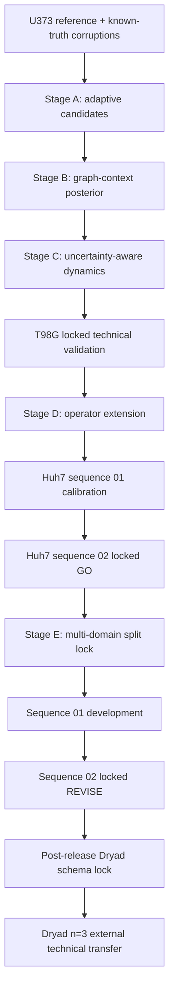

# Glioblastoma Tracking Uncertainty Audit

[](https://github.com/mohamad679/glioblastoma-cell-tracking-uncertainty/actions/workflows/tests.yml)
[](https://github.com/mohamad679/glioblastoma-cell-tracking-uncertainty/actions/workflows/reproduce-benchmark.yml)
[](https://github.com/mohamad679/glioblastoma-cell-tracking-uncertainty/actions/workflows/release.yml)

A reproducible technical audit of how cell-tracking errors and association uncertainty propagate into migration and latent-state estimates.

The primary technical benchmark uses expert annotations from the Cell Tracking Challenge PhC-C2DH-U373 dataset. GlioTrace brain-slice data remain exploratory. A post-release external technical-transfer arm evaluates the frozen method on three independent rat PDGFB-glioma brain-slice experiments from Dryad. **The repository does not claim validated human-GBM biology or clinical utility.**

## Current status

| Field | Status |
| --- | --- |
| Version | `1.0.0` |
| Python | 3.11–3.13 |
| License | MIT |
| Tests | CI enforced on all supported Python versions |
| Coverage | 65% enforced CI gate |
| Technical benchmark | Complete |
| Stage D | Formally closed; v3 qualified `GO` after Huh7 sequence-01 calibration and locked sequence-02 evaluation |
| Stage E-Final | Complete; valid one-time locked result is `REVISE` |
| External glioma transfer | Complete; Dryad biological `n=3` |
| Project state | Closed as a technical/research-engineering portfolio artifact; post-release Dryad evidence extension complete |
| Human GBM / clinical validation | Not supported |

The final evidence is intentionally mixed. Stage D v3 produced a bounded within-Huh7 technical `GO`. Stage E-Final remained `REVISE`: calibration and selective-risk gates passed, while the registered real-data AUPRC and motion-win gates did not. That historical decision is immutable.

The post-release Dryad arm used a separately frozen, pre-outcome schema lock and no Dryad-specific retuning. Across three independent rat glioma brain-slice experiments, calibrated uncertainty improved association-error ranking and selective risk relative to distance confidence, while the frozen `p >= 0.5` uncertainty-compatible hard reconstruction had lower link F1 than hard nearest-neighbour tracking in all three experiments and did not improve the main motion-error endpoints.

## Start here

- [`docs/README.md`](docs/README.md) — documentation index and evidence/archive map
- [`docs/final-project-report.md`](docs/final-project-report.md) — consolidated technical conclusions
- [`docs/dryad-confirmatory-final-report.md`](docs/dryad-confirmatory-final-report.md) — final Dryad `n=3` external-transfer report
- [`docs/architecture.md`](docs/architecture.md) — architecture and scientific boundaries
- [`docs/reproduction.md`](docs/reproduction.md) — reproduction guide
- [`docs/project-closure-report.md`](docs/project-closure-report.md) — formal closure and claim boundary
- [`docs/roadmap.md`](docs/roadmap.md) — chronological research progression

Current frozen protocols, locks, manifests and machine-readable results live under [`docs/evidence/`](docs/evidence/). Superseded protocols, development-only tuning artifacts and earlier stage generations are preserved under [`docs/archive/`](docs/archive/). No scientific evidence was deleted during the documentation cleanup.

## What this project demonstrates

- deterministic benchmark construction from expert tracking masks and lineages;
- 17 seeded known-truth corruption scenarios;
- truth-blind candidate construction and baseline association evaluation;
- graph-context marginalized link probabilities and calibrated uncertainty;
- hard and soft downstream migration/dynamics sensitivity analysis;
- locked independent technical evaluations on T98G and Huh7;
- multi-domain Stage E development/test separation;
- pre-outcome schema locking for external glioma transfer;
- replicate-aware reporting with experiment-level biological `n`;
- provenance, artifact-contract and leakage checks;
- pinned environments, packaging smoke tests and real-data GitHub Actions workflows;
- explicit separation between technical evidence and biological interpretation.

## Architecture



See [`docs/architecture.md`](docs/architecture.md) for module-level details.

## Installation

```bash
python3 -m venv .venv
source .venv/bin/activate
python -m pip install -c constraints.txt -e .
```

For the local Dryad source-inspection utilities:

```bash
python -m pip install -c constraints.txt -e '.[dryad]'
```

The exact validated dependency environment is recorded in `constraints.txt`.

## Validate the package

```bash
python -m pip install -c constraints.txt -e . coverage
coverage run --source=gbm_audit -m unittest discover -s tests -q
coverage report --show-missing --fail-under=65
```

GitHub Actions additionally build and reinstall the wheel as a packaging smoke test.

## Reproduce the U373 benchmark

The full pinned benchmark is automated by `.github/workflows/reproduce-benchmark.yml`. It installs the pinned environment, downloads the official U373 training archive, builds the reference manifest, generates the corruption benchmark, evaluates baseline/uncertainty/dynamics stages, and uploads numeric results as a workflow artifact.

The frozen reproduced-result snapshot is [`docs/evidence/engineering/reproduced-results-2026-09-19.json`](docs/evidence/engineering/reproduced-results-2026-09-19.json).

## Key modules

| Module | Responsibility |
| --- | --- |
| `benchmark.py` | Build deterministic U373 reference manifest |
| `corruptions.py` | Generate seeded known-truth corruption scenarios |
| `adaptive_candidates.py` | Build deterministic truth-blind candidate graphs |
| `uncertainty.py` | Association hypotheses and calibrated probabilities |
| `dynamics.py`, `soft_dynamics.py` | Hard/soft downstream migration and state summaries |
| `t98g_audit.py` | Lock T98G provenance and reference structure |
| `stage_c_v2_t98g_evaluation.py` | Frozen Stage C v2 T98G evaluation |
| `stage_d_huh7_audit.py` | Audit and lock Huh7 sequences |
| `stage_d_v3_development.py` | Fit bounded Huh7 sequence-01 calibration |
| `stage_d_v3_evaluation.py` | Evaluate locked Huh7 sequence 02 |
| `stage_e_data.py` | Verify CTC sources and enforce Stage E split boundaries |
| `stage_e_metrics.py` | AUPRC, selective-risk and calibration metrics |
| `stage_e_development.py` | Stage E sequence-01 development fit |
| `stage_e_evaluation.py` | One-time Stage E sequence-02 evaluator |
| `dryad_schema_probe.py` | Extract schema-only evidence from verified Dryad source |
| `dryad_local.py`, `dryad_local_safe.py` | Verify, inventory and normalize Dryad experiments |
| `dryad_confirmatory.py` | Frozen three-experiment Dryad transfer evaluation |
| `validation.py` | Cross-stage artifact/provenance contracts |
| `archive.py` | External ZIP safety limits |

## Exploratory GlioTrace pilot

GlioTrace remains a qualitative/exploratory application and is intentionally separated from the quantitative reference-backed benchmark.

```bash
python scripts/fetch_pilot_rois.py
python -m gbm_audit.roi data/raw/glio_trace/Set_67/exp_333_roi_84_stack.npz --output results/set67-roi.json
python -m gbm_audit.roi data/raw/glio_trace/Set_68/exp_337_roi_63_stack.npz --expected-frames 68 --output results/set68-roi.json
```

Raw third-party data and generated `results/` outputs are not source-controlled.

## Evidence layout

The detailed index is [`docs/README.md`](docs/README.md). Key evidence groups are:

- [`docs/evidence/stage-a/`](docs/evidence/stage-a/)
- [`docs/evidence/stage-b/`](docs/evidence/stage-b/)
- [`docs/evidence/stage-c/`](docs/evidence/stage-c/)
- [`docs/evidence/stage-d/`](docs/evidence/stage-d/)
- [`docs/evidence/stage-e/`](docs/evidence/stage-e/)
- [`docs/evidence/dryad/`](docs/evidence/dryad/)
- [`docs/evidence/external/`](docs/evidence/external/)
- [`docs/evidence/engineering/`](docs/evidence/engineering/)

Historical/superseded evidence is retained under [`docs/archive/`](docs/archive/), rather than mixed into the reader-facing document root.

## Sources

- Cell Tracking Challenge U373 — primary technical benchmark; phase-contrast cells on a substrate, not brain slices.
- GlioTrace example data — exploratory brain-slice application.
- T98G electrotaxis — locked Stage C v2 technical validation.
- Cell Tracking Challenge Huh7 — independent Stage D operator benchmark.
- Dryad `10.5061/dryad.s4d28` — three rat PDGFB-glioma brain-slice experiments used for the post-release external technical-transfer arm; deposited files are hash-verified locally and are not redistributed by this repository.

Dataset licenses and redistribution terms are independent from this repository's MIT source-code license.

## Contributing, security and release process

See [`CONTRIBUTING.md`](CONTRIBUTING.md) and [`SECURITY.md`](SECURITY.md). Tags matching `v*` trigger `.github/workflows/release.yml`, which verifies the package/tag version, runs the test/coverage gate, builds and reinstalls the wheel, and only then creates a GitHub Release.
