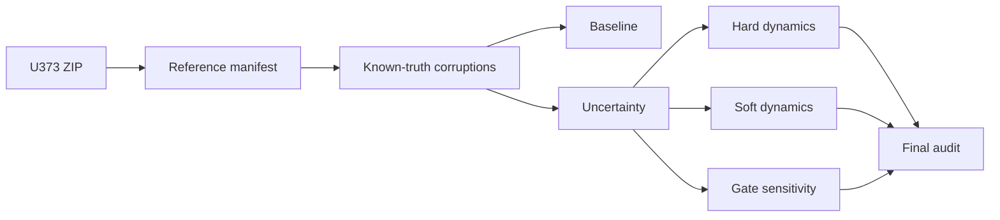

# Glioblastoma Tracking Uncertainty Audit

[](https://github.com/mohamad679/gbm-tracking-uncertainty/actions/workflows/tests.yml)
[](https://github.com/mohamad679/gbm-tracking-uncertainty/actions/workflows/reproduce-benchmark.yml)
[](https://github.com/mohamad679/gbm-tracking-uncertainty/actions/workflows/release.yml)

A reproducible technical audit of how tracking errors and association uncertainty propagate into migration and latent-state estimates for cell-tracking pipelines.

The quantitative benchmark uses expert annotations from the Cell Tracking Challenge PhC-C2DH-U373 dataset. GlioTrace brain-slice data are retained as an exploratory application only. **This repository does not make a validated biological or clinical claim.**

## Current status

**Version:** `0.1.0`  
**Python:** 3.11-3.13  
**License:** MIT  
**Tests:** 60 tests; CI enforced on all supported Python versions
**Coverage:** 70% package coverage, 65% enforced CI gate
**Technical benchmark:** complete  
**Operator learning:** HOLD  
**Biological validation claim:** not supported

The operator-learning gate is evidence-derived: none of the tested proposal radii simultaneously satisfies the declared clean-link coverage and localization-noise robustness criteria.

## What this project demonstrates

- deterministic benchmark construction from expert tracking masks and lineages;
- 17 seeded known-truth corruption scenarios;
- baseline and uncertainty-aware association evaluation;
- calibrated link probabilities with development/test separation;
- hard and soft downstream dynamics sensitivity analysis;
- artifact schema/provenance validation across pipeline stages;
- reproducible, pinned environments and real-data GitHub Actions runs;
- regression testing for scientific-correctness bugs;
- archive safety limits for external ZIP inputs;
- performance refactoring with output-equivalence tests;
- explicit separation between technical evidence and biological interpretation.

## Architecture



See [`docs/architecture.md`](docs/architecture.md) for the full module-level architecture, invariants, safety layer, and reproducibility boundaries.

## Reproducible installation

```bash
python3 -m venv .venv
source .venv/bin/activate
python -m pip install -c constraints.txt -e .
```

On Windows PowerShell:

```powershell
.venv\Scripts\Activate.ps1
python -m pip install -c constraints.txt -e .
```

The validated exact dependency environment is recorded in `constraints.txt`. Runtime provenance in the final audit records package version, Python version, dependency versions, and Git commit SHA.

## Validate the package

```bash
python -m pip install -c constraints.txt -e . coverage
coverage run --source=gbm_audit -m unittest discover -s tests -q
coverage report --show-missing --fail-under=65
```

GitHub Actions additionally builds and reinstalls the wheel as a packaging smoke test on every relevant push.

## Reproduce the U373 benchmark

The full pinned benchmark is automated by `.github/workflows/reproduce-benchmark.yml`. The workflow:

1. installs the pinned environment;
2. runs the tests;
3. downloads the official U373 training archive;
4. builds the reference manifest;
5. generates all corruption scenarios;
6. evaluates baseline and uncertainty stages;
7. evaluates hard/soft dynamics and gate sensitivity;
8. creates the final audit;
9. uploads the numeric results as a GitHub Actions artifact.

The latest frozen result summary is in [`docs/reproduced-results-2026-09-19.json`](docs/reproduced-results-2026-09-19.json).

## Pipeline modules

| Module | Responsibility |
|---|---|
| `benchmark.py` | Build deterministic U373 reference manifest |
| `corruptions.py` | Generate 17 seeded known-truth scenarios |
| `baseline.py` | Frozen greedy nearest-neighbour comparator |
| `uncertainty.py` | Sample one-to-one association hypotheses and calibrate probabilities |
| `adaptive_candidates.py` | Build deterministic, truth-blind adaptive candidate graphs |
| `dynamics.py` | Hard migration and two-state HMM sensitivity |
| `soft_dynamics.py` | Probability-weighted migration and transition summaries |
| `gate_sensitivity.py` | Proposal-radius robustness sweep |
| `final_audit.py` | Evidence-derived project decision gates |
| `validation.py` | Cross-stage artifact contracts and provenance checks |
| `archive.py` | External ZIP safety limits and bounded reads |
| `config.py` | Shared benchmark defaults |
| `calibration.py`, `numerics.py` | Shared mathematical utilities |

## Exploratory GlioTrace pilot

The project also retains a small qualitative GlioTrace workflow for visual inspection. It is intentionally separate from the quantitative U373 benchmark.

```bash
python scripts/fetch_pilot_rois.py
python -m gbm_audit.roi data/raw/glio_trace/Set_67/exp_333_roi_84_stack.npz --output results/set67-roi.json
python -m gbm_audit.roi data/raw/glio_trace/Set_68/exp_337_roi_63_stack.npz --expected-frames 68 --output results/set68-roi.json
```

Raw data and generated `results/` outputs are not source-controlled.

## Evidence and reports

- [`docs/final-project-report.md`](docs/final-project-report.md) — overall technical conclusions
- [`docs/reproduction.md`](docs/reproduction.md) — detailed reproduction guide
- [`docs/architecture-performance-report.md`](docs/architecture-performance-report.md) — Stage 3 hardening/refactor evidence
- [`docs/reproducibility-packaging-report.md`](docs/reproducibility-packaging-report.md) — packaging/reproducibility evidence
- [`docs/engineering-hardening-report.md`](docs/engineering-hardening-report.md) — correctness/testing evidence
- [`docs/reproduced-results-2026-09-19.json`](docs/reproduced-results-2026-09-19.json) — frozen machine-readable result snapshot
- [`docs/stage-a-protocol.md`](docs/stage-a-protocol.md) — frozen adaptive-candidate benchmark contract
- [`docs/stage-a-step2-adaptive-generator.md`](docs/stage-a-step2-adaptive-generator.md) — adaptive v1 engineering design and scope
- [`CHANGELOG.md`](CHANGELOG.md) — release history

## Sources

- Technical benchmark: [Cell Tracking Challenge U373](https://celltrackingchallenge.net/2d-datasets/), phase-contrast cells on a substrate, not brain slices.
- Exploratory images: [GlioTrace example data, Zenodo 21981544](https://zenodo.org/records/21981544).
- Reference implementation: [Gliomethods/GlioTrace](https://github.com/Gliomethods/GlioTrace).
- Secondary technical benchmark candidate: [T98G electrotaxis](https://zenodo.org/records/19026908).

Dataset licenses and redistribution terms are independent from this repository's MIT source-code license.

## Contributing and security

See [`CONTRIBUTING.md`](CONTRIBUTING.md) for development and scientific-change requirements, and [`SECURITY.md`](SECURITY.md) for vulnerability reporting guidance.

## Release process

`v*` tags trigger `.github/workflows/release.yml`. The workflow verifies that the tag version matches the installed package version, runs the test/coverage gate, builds and reinstalls the wheel, and creates a GitHub Release only after validation succeeds.
