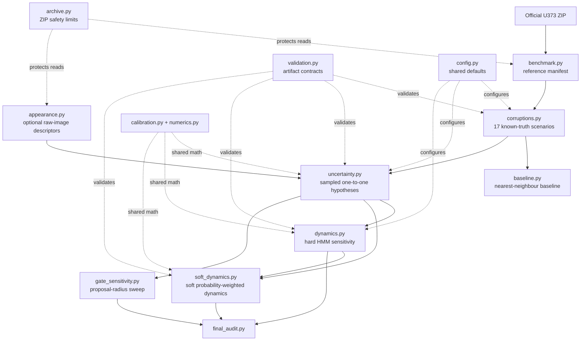

# Architecture

## Purpose

This repository is a reproducible technical audit of uncertainty-aware cell tracking. Its quantitative reference is the Cell Tracking Challenge PhC-C2DH-U373 dataset. GlioTrace brain-slice data remain exploratory and are not used to claim biological validation.

## Pipeline

## Architectural boundaries

### Reference and corruption layer

`benchmark.py` extracts a frozen manifest from expert U373 tracking masks and lineage tables. `corruptions.py` creates deterministic synthetic error scenarios with known evaluation truth. Truth is retained for evaluation and is not provided to tracking algorithms.

### Tracking and uncertainty layer

`baseline.py` provides the frozen greedy nearest-neighbour comparator. `uncertainty.py` samples globally compatible frame-to-frame hypotheses and calibrates posterior link probabilities on development sequence 01 before evaluating sequence 02 unchanged.

### Dynamics layer

`dynamics.py` converts deterministic representations into migration and two-state Gaussian HMM summaries. `soft_dynamics.py` propagates posterior probabilities directly. Its transition accumulation uses indexed edge adjacency instead of an all-pairs scan.

### Contract and safety layer

`validation.py` enforces schema version, provenance hashes, corruption seed, scenario identity, metadata, and sequence identity across stages. `archive.py` limits archive member count, per-member uncompressed size, total uncompressed size, compression ratio, and bounded reads.

### Reproducibility layer

`constraints.txt`, GitHub Actions, runtime provenance, and the frozen result snapshot make the validated environment and outputs traceable. Generated `results/` and raw datasets remain outside source control.

## Key invariants

- Scenario joins are by `scenario_id`, never positional order.
- Corruption seed and reference-manifest identity must agree across downstream artifacts.
- Sampled links are one-to-one within each frame transition.
- HMM transition matrices must be finite and row-stochastic.
- Appearance descriptors have a fixed length of 28.
- The technical benchmark must not be presented as biological validation.

## Current decision gate

The staged technical pipeline is complete. Stage D v3 reached a qualified `GO`: the zero-shot Huh7 candidate remained `HOLD` because of mean-speed bias, while the bounded blend calibrated on Huh7 sequence `01` passed every pre-registered gate on locked sequence `02`. This supports calibrated within-Huh7 sequence generalization only; it does not establish zero-shot or biological generalization.

Stage E-Final is also complete. Its valid one-time locked multi-domain CTC evaluation produced `REVISE`, and no post-test retuning was performed. The project is therefore closed at version `1.0.0` as a reproducible technical/research-engineering portfolio artifact, without a validated biological or clinical claim.
