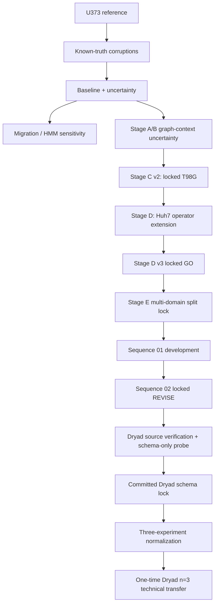

# Architecture

## Purpose

This repository is a reproducible technical audit of uncertainty-aware cell tracking. Its primary quantitative reference is the Cell Tracking Challenge PhC-C2DH-U373 dataset. GlioTrace brain-slice data remain exploratory. A post-release external-transfer arm adds three independent rat glioma brain-slice experiments from Dryad under a pre-outcome schema lock. None of these results establish human-GBM-wide biological or clinical validation.

## Pipeline

## Core layers

### Reference and corruption layer

`benchmark.py` extracts a frozen U373 reference manifest from expert tracking masks and lineage tables. `corruptions.py` creates deterministic synthetic error scenarios with known evaluation truth. Truth is retained for evaluation and is not supplied to tracking algorithms.

### Tracking and uncertainty layer

`baseline.py` provides the frozen greedy nearest-neighbour comparator. `adaptive_candidates.py` and the later graph-context modules construct truth-blind candidate graphs and marginalized association probabilities. `uncertainty.py` samples compatible hypotheses and supports calibrated link probabilities.

### Dynamics layer

`dynamics.py` converts deterministic representations into migration and two-state Gaussian HMM summaries. `soft_dynamics.py` propagates posterior probabilities directly. Its transition accumulation uses indexed adjacency instead of an all-pairs scan.

### Locked independent validation layers

- Stage C v2 uses the independently locked T98G source.
- Stage D uses Huh7 with sequence `01` for bounded calibration and separately locked sequence `02` for the final v3 evaluation.
- Stage E uses registered CTC GOWT1/HeLa/SIM+ development/test roles, with sequence `02` protected from fitting/selection.
- The Dryad extension verifies source hashes, inspects schema without method outcomes, commits the exact three-experiment mapping, normalizes deterministically, and then executes the frozen evaluator once.

### Contract and safety layer

`validation.py` enforces schema version, provenance hashes, corruption seed, scenario identity, metadata and sequence identity across stages. `archive.py` and the hardened Dryad wrapper constrain external archive reads and reject ambiguous/unsafe inputs while allowing explicitly non-tabular binary assets to remain outside schema parsing.

### Reproducibility layer

`constraints.txt`, GitHub Actions, runtime provenance, frozen locks and committed machine-readable evidence make the validated environment and outcomes traceable. Raw third-party datasets and generated `results/` remain outside source control.

Current evidence is organized under [`evidence/`](evidence/); superseded and development-only artifacts are retained under [`archive/`](archive/).

## Key invariants

- Scenario joins use stable identifiers, never positional order.
- Reference identity and frozen seeds/configurations must agree across downstream artifacts.
- Locked test sources are not used for fitting or selection.
- Sampled links respect one-to-one frame-transition constraints.
- HMM transition matrices must remain finite and row-stochastic.
- External-source schema mapping must be committed before method-performance inspection.
- Historical `HOLD`/`REVISE` outcomes are immutable.
- Technical benchmarks and rat-glioma transfer evidence must not be presented as human biological or clinical validation.

## Final decision state

Stage D v3 reached a qualified technical `GO` after bounded Huh7 sequence-01 calibration and a separately locked sequence-02 evaluation. Stage E-Final completed one valid locked multi-domain evaluation and remained `REVISE`; no post-test retuning was performed.

The later Dryad extension does not alter those decisions. It shows external technical transfer of calibrated uncertainty as an association-error ranking/calibration/selective-risk layer across three rat glioma brain-slice experiments, while the frozen `p >= 0.5` uncertainty-compatible hard tracker does not outperform hard nearest-neighbour tracking on link F1 or the main downstream motion errors.
